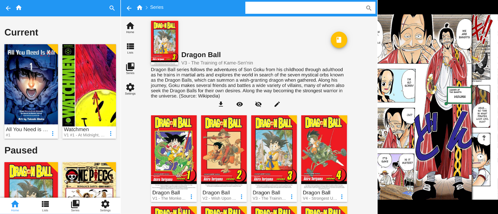

# ComicBox

ComicBox is a web based comic reader and manager that serves your digital comic book collection.



## Features

- Track your progress per book and per series
- Continue where you left off between devices.
- Keep track of the series you are currently reading and the ones you will come back to with lists.
- Let your friends access your collection with multiple accounts

## Setup

Building this project requires the following:
 * [go](https://golang.org/)
 * [nodejs](https://nodejs.org/en/)
 * [npm](https://www.npmjs.com/)

Each of these dependencies can be installed in their own way depending on platform, follow the instructions that match your environment.

1. Clone the repository.
```
$ git clone https://github.com/comicbox/comicbox.git
```

2. Download the dependencies.
```
$ make get
```

3. Build the project
```
$ make
```

4. (**Optional**) Create a configuration file for the server.

```
$ cat > config.yml
port: 8080 # Port the server will listen on (default=8080)
dir: /path/to/your/comics # Path to the directory containing your comics (default=/home/<your user>/comics/)
```

1. Run the server
```
$ ./bin/comicboxd
Using config file: /home/<your user>/go/src/github.com/comicbox/comicbox/config.yml

 .d8888b.                         d8b          888888b.
d88P  Y88b                        Y8P          888  "88b
888    888                                     888  .88P
888         .d88b.  88888b.d88b.  888  .d8888b 8888888K.   .d88b.  888  888
888        d88""88b 888 "888 "88b 888 d88P"    888  "Y88b d88""88b `Y8bd8P'
888    888 888  888 888  888  888 888 888      888    888 888  888   X88K
Y88b  d88P Y88..88P 888  888  888 888 Y88b.    888   d88P Y88..88P .d8""8b.
 "Y8888P"   "Y88P"  888  888  888 888  "Y8888P 8888888P"   "Y88P"  888  888

I: 09:22:28 Starting server at http://localhost:8080
```

You're done! Simply navigate to [localhost:8080](localhost:8080) to access the app.

To scan the specified directory for books go to the settings page and click `START SCAN`
